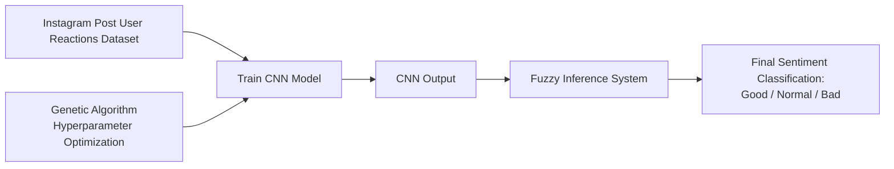

# PACD Final Project

## Identity

- Name: Wilson Angelie Tan
- NIM: 140810230024

## Project Description

This project is about analyzing sentiment on Instagram posts based on user reactions. The system classifies reactions into three categories: good, normal, or bad.

The model workflow is illustrated below:



## Group Profile

- Francisco Gilbert Sondakh - 140810230004
- Wilson Angelie Tan - 140810230024
- Theophilus Samuel Ghozali - 140810230054

## Setup

This project uses `uv` for dependency management.

If `uv` is not installed yet, run this PowerShell command:

```powershell
powershell -ExecutionPolicy ByPass -c "irm https://astral.sh/uv/install.ps1 | iex"
```

After `uv` is installed, synchronize the project dependencies:

```powershell
uv sync
```

## Run the Project

To run the main program, use:

```powershell
uv run python main.py
```
